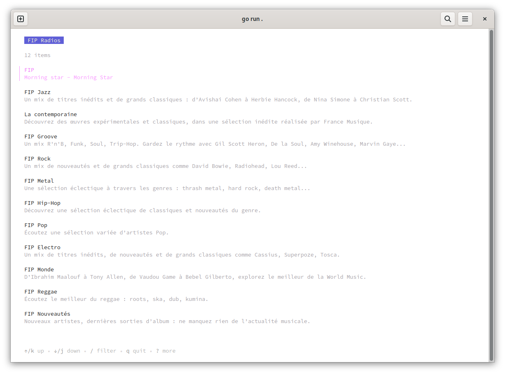

# FIP-Player

A simple fip radio player with mpris metadata

  

# Credits

* A cool dbus lib: https://github.com/godbus/dbus
* A nice mpv lib binding: https://github.com/aykevl/plaincast
* Awesome mpris implementation using godbus: https://github.com/natsukagami/mpd-mpris
