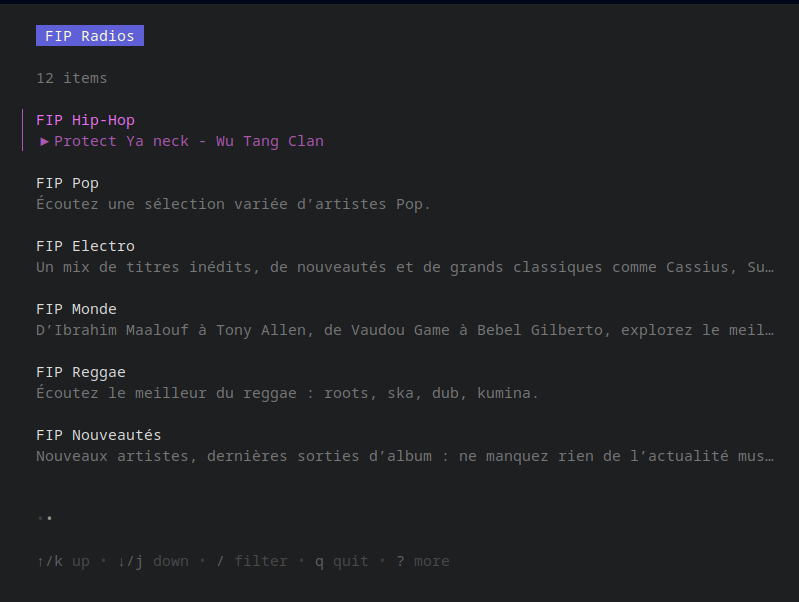

# FIP-Player

A simple FIP radio (and Radio France) player with mpris metadata

White theme
<p align="center">
  
</p>

Dark theme
<p align="center">
  
</p>

# How to use

## Install the dependencies

You need to have **libmpv** installed on your system.

**Arch**
```shell
pacman -S mpv
```

**Ubuntu**
```shell
apt install libmpv-dev
```

**Fedora**
```shell
dnf install mpv-devel
```

## Install FIP-Player

### Use pre builds

[**Download latest release**](https://github.com/DucNg/fip-player/releases/download/latest/fip-player)

```shell
chmod +x fip-player
./fip-player
```
 
Install
```
sudo cp fip-player /usr/local/bin
```

### Install using the golang toolchain

```shell
go install github.com/DucNg/fip-player@latest
```

## Build and run

**Requires Go >= 1.19 and libmpv**

`go run .`

Run in debug mode (creates a log file in /tmp)

`go run . -d`

# Credits

* A cool dbus lib: https://github.com/godbus/dbus
* Nice libmpv bindings: https://github.com/aykevl/plaincast
* Awesome mpris implementation using godbus: https://github.com/natsukagami/mpd-mpris
* Pretty TUI lib: https://github.com/charmbracelet/bubbletea
